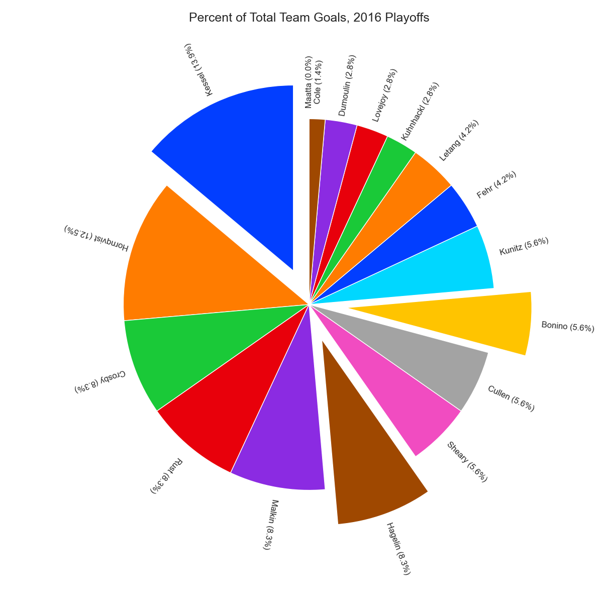
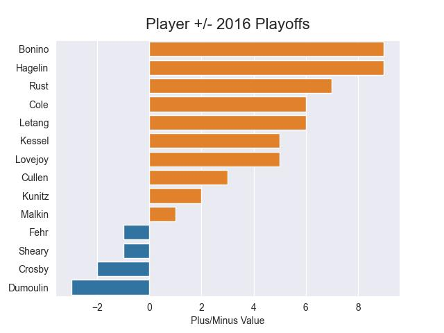
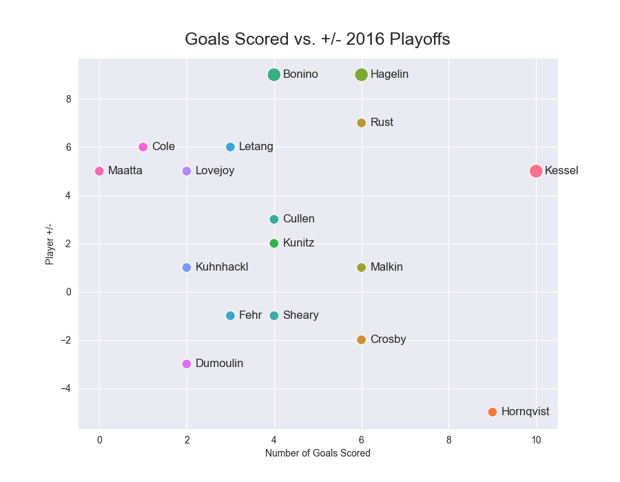
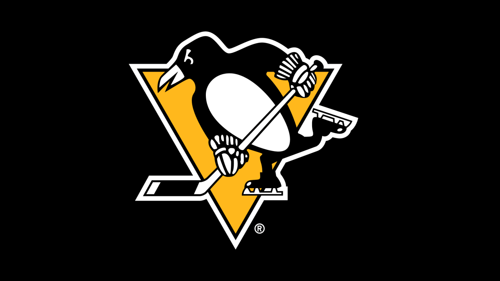

# Exploring the Influence of the HBK Line on the Pittsburgh Penguins' 2016 and 2017 Stanley Cup Wins
## Motivation
As a newcomer to the world of hockey and enthusiast of the Pittsburgh Penguins, the team's storied history has left an indelible mark. While the Penguins have claimed the Stanley Cup only five times (1991, 1992, 2009, 2016, and 2017), the recent back-to-back victories in 2016 and 2017 are particularly intriguing.

Given my limited exposure to the sport, I've often heard passionate debates among fans about the driving force behind these last two victories. Surprisingly, it wasn't the usual suspects like Sidney Crosby or Evgeni Malkin that took center stage. Instead, rumors circulate that third line trio—Phil Kessel, Carl Hagelin, and Nick Bonino, known as the 'HBK Line'—was the heralded hero of these championships.

Now, armed with an eagerness to understand the intricacies of hockey and spurred by the curiosity of whether this claim holds water, I embark on a journey of exploration. The goal is to unravel the mysteries of the HBK Line's influence during the 2016 and 2017 playoff seasons, where these victories marked not only significant milestones in the Penguins' history but also the last triumphs to date.


## Objective and Scope
This short analysis will delve into the specifics of the 2016 and 2017 playoff seasons, meticulously examining the contributions of Carl Hagelin, Nick Bonino, and Phil Kessel. 

The project is limited in scope to members of the Pittsburgh Penguin during the 2015-2016 playoff games.

New to hockey? No problem! 
[Click here for everything you need to know about hockey to understand the project.](data_dictionary.md)

## Key Questions
In this beginner-friendly exploration of the Pittsburgh Penguins' 2016 and 2017 Stanley Cup victories, several key questions guide our analysis:

### 1. Unraveling Player Performance:
   - **How did individual players contribute across various statistical measures?**
     - Dive into CORSI, fenwick, shots, penalty differentials, faceoff percentages, and more to dissect the nuances of player performance.

### 2. HBK Line Impact:
   - **Did the HBK Line truly stand out statistically during the playoffs?**
     - Examine the performance of Phil Kessel, Carl Hagelin, and Nick Bonino compared to other key players, exploring their influence in different rounds and for each playoff year overall.

### 3. Playoff Dynamics:
   - **How did player statistics evolve throughout the playoffs, and did certain trends emerge?**
     - Track changes in player stats over the course of the playoff rounds, identifying patterns and shifts that might have contributed to the Penguins' success.

### 4. Visualizing Trends:
   - **How can visualizations enhance our understanding of player contributions and team dynamics?**
     - Leverage visual representations to distill complex statistical data into meaningful insights, making the analysis accessible for both hockey enthusiasts and beginners.

### 5. Player Consistency:
   - **Were certain players consistently impactful throughout both playoff years, or did performance vary significantly from year to year?**
     - Evaluate player consistency across different statistical metrics to identify reliable contributors during each of the Penguins' championship runs.

This project aims to provide a comprehensive yet beginner-friendly exploration, using visualizations as a tool to unravel the intricacies of player performances and their collective impact on the team's success.


## Data Sources

To conduct this analysis, I utilized comprehensive data from [Hockey Reference](https://www.hockey-reference.com/). This source provided rich datasets encompassing playoff rosters to advanced statistics, offering a view of player performances and team dynamics for each playoff year.

Additionally, I incorporated data from [NHL Game Data](https://www.kaggle.com/datasets/martinellis/nhl-game-data), a valuable resource comprised of a collection of CSV files containing detailed game, team, and player statistics. This Kaggle dataset includes information on player-level metrics, game events (including (x,y) coordinates), and team-level summaries, enabling a detailed examination of every aspect of the game.


### Data Processing and Transformation

#### Hockey Reference Data:
Information gained from Hockey Reference was restructured to align with the analytical needs of this project: 
- The data was cleaned and organized using the python Pandas library to ensure consistency across different dataFrames. 
- The advanced statistics and playoff rosters were seamlessly integrated into a coherent dataset that formed the foundation for in-depth analyses.

#### Kaggle NHL Game Data:
The Kaggle dataset comprised of CSV files presented a unique opportunity to enhance the granularity of our analysis. To facilitate efficient querying and manipulation, I transformed this collection of CSV files into a relational database using SQLite. 

The resulting SQL database serves as a centralized repository, streamlining the retrieval of specific data points and enabling complex cross-referencing between different aspects of the game.


### Replicating the Analysis

To replicate the analysis and explore the project's findings on your device, follow the steps outlined in the 'Getting Started' section of this README. 

This includes :
- cloning the repository 
- setting up a virtual environment
- running the [create_SQL_db](create_sql_db.ipynb) notebook to generate the 'NHL_data.db' SQLite database.

Each playoff year study is hosted in it's own jupyter notebook. Though each notebook stands alone in its analysis, it is recommended to run in order:
- [2016 Playoff Analysis](Pens_playoff_analysis_2016.ipynb)
- [2017 Playoff Analysis](Pens_playoff_analysis_2017.ipynb)

Additional files available in the repo:
- [Demonstration of how I pre-trimmed the NHL data-set before use](trim_game_plays.ipynb)
- [SQL queries used throughout the analysis](SQL_queries.py)
- [Functions I wrote for file manipulation](data_files_manipulation.py)


## Getting Started
### To replicate this project:

1. Clone the repository to your machine:
    ```bash
    git clone https://github.com/boncz/PenguinsHockeyAnalysis.git
    ```
2. Create and activate a virtual environment, and install required packages from 'requirements.txt':
- **Linux/Mac:**
  ```bash
  python3 -m venv venv
  source venv/bin/activate
  pip install -r requirements.txt
  ```
- **GitBash:**
  ```bash
  python -m venv venv
  source venv/Scripts/activate
  pip install -r requirements.txt
  ```
3. Once complete, be sure to deactivate:
    ```
    deactivate
      ```

3. Run the [create_sql_db](create_sql_db.ipynb) notebook to unzip data files and create 'NHL_data.db' for future SQL queries.
4. Ensure that all data files have successfully moved to the main project directory before running the playoff analysis notebooks. 

## Key Findings and Visual Sneak Peeks

### Comparative Analysis: HBK Line
A crucial aspect of this investigation was comparing the performance of the HBK Line with the team as a whole. Here's a glimpse of how their statistics stacked up:

In 2016, the HBK line scored almost 1/3 of the team's total goals.



Bonino and Hagelin boast impressively high +/- ratings, indicating their substantial contributions to the team's goal differentials. The +/- statistic reflects the net goals scored by a team while a player is on the ice, considering both goals for and against. 

High +/- values suggest that these players not only excel in scoring but also play defensively sound hockey, positively impacting the team's overall performance during their time on the ice.


The HBK line members are positioned in the upper right boundaries of this chart, showcasing a blend of elevated +/- and a substantial number of goals scored.

## Summary
### 2016 Playoffs: A Triumphant Symphony
The analysis of the HBK line's performance during the 2016 playoffs provides a comprehensive understanding of their impact on the Pittsburgh Penguins' success in winning the Stanley Cup. Notably, Nick Bonino's consistent faceoff differentials and Phil Kessel's impressive number of shots taken highlight their pivotal roles. The line's balance is evident in Phil Kessel's dominant offensive contributions, Carl Hagelin's physical presence, and Bonino's shot-blocking proficiency.

Examining advanced metrics, the HBK line's Thru%, Corsi, and Fenwick metrics challenge traditional expectations, emphasizing the nuanced contributions of less-recognized players. Despite the team's fanfare for the HBK line, their positioning in puck possession metrics reveals the multifaceted nature of player roles.

In scoring, the HBK line's prowess is evident, with Kessel's goal-scoring, Bonino's playmaking, and Hagelin's utility contributing significantly. The line's positive impact on goals, PDO, and +/- further cements their importance, accounting for nearly one-third of all goals during the playoffs.

The HBK line's exceptional performance challenges conventional expectations, showcasing the synergy of their individual skills and collective contributions. Their significant role in the Penguins' 2016 Stanley Cup victory underscores the importance of well-balanced lines and the unpredictable nature of player impact in hockey.

### 2017 Playoffs: A Narrative of Evolution
In contrast to the previous year, the 2017 Playoffs showcase a shift in goal contributions. The HBK line accounted for only 20.3% of the team's total goals. A comparative analysis against the first and second lines further emphasizes this shift. 

The first line, led by Crosby, Sheary, and Guentzel, secured a substantial 33.3% of all goals, presenting the conventional progression observed across hockey lines. The HBK line's reduced goal contribution invites further exploration into the intricacies of offensive strategies and interactions between lines.

The exploration of the HBK line's dynamics in the 2017 playoffs unravels a story of adaptation and transformation. From shifts in shooting efficiency to recalibrated assist landscapes and dispersed advanced metrics, the line's journey in 2017 beckons researchers to delve deeper into the factors influencing player performances and their nuanced impact on team success within the dynamic realm of hockey.

### Conclusion
The analysis of the HBK line's performance during the 2016 and 2017 playoffs unfolds a multifaceted narrative, revealing the complex nature of player contributions and the ever-shifting landscape of hockey strategy.

2016 Playoffs: The HBK line emerged as a formidable force, showcasing a balance of offensive prowess, defensive acumen, and playmaking abilities. Their impact on goals, advanced metrics, and overall team success solidified their significance in the Penguins' Stanley Cup victory.

2017 Playoffs: A narrative of evolution and adaptation takes center stage as the HBK line's goal contributions diminish. The shift prompts inquiries into altered team strategies and the interplay between lines, opening avenues for deeper exploration into the nuances of offensive game plays.

These analyses serve as a testament to the complexity of hockey, where success is orchestrated through a symphony of individual performances and strategic adaptations. 

As the HBK line's story unfolds across two playoff seasons, it invites continued exploration, discussion, and appreciation for the intricate dynamics that propel teams to championship glory in the world of hockey.


## Acknowledgments


I want to give a shoutout to the people who made this little hockey project possible.

Big thanks to my husband, the lifelong Pens fan, whose passion for hockey ignited my love for both playing and watching the game.

To the online hockey gurus and forums, thanks for being my virtual guides in this journey. And to anyone else who's reading this, thanks for tagging along on this preliminary analysis of the Penguins' success story.

Let's drop the puck and dive into the fascinating world of the HBK Line and the Pittsburgh Penguins' championship legacy!




